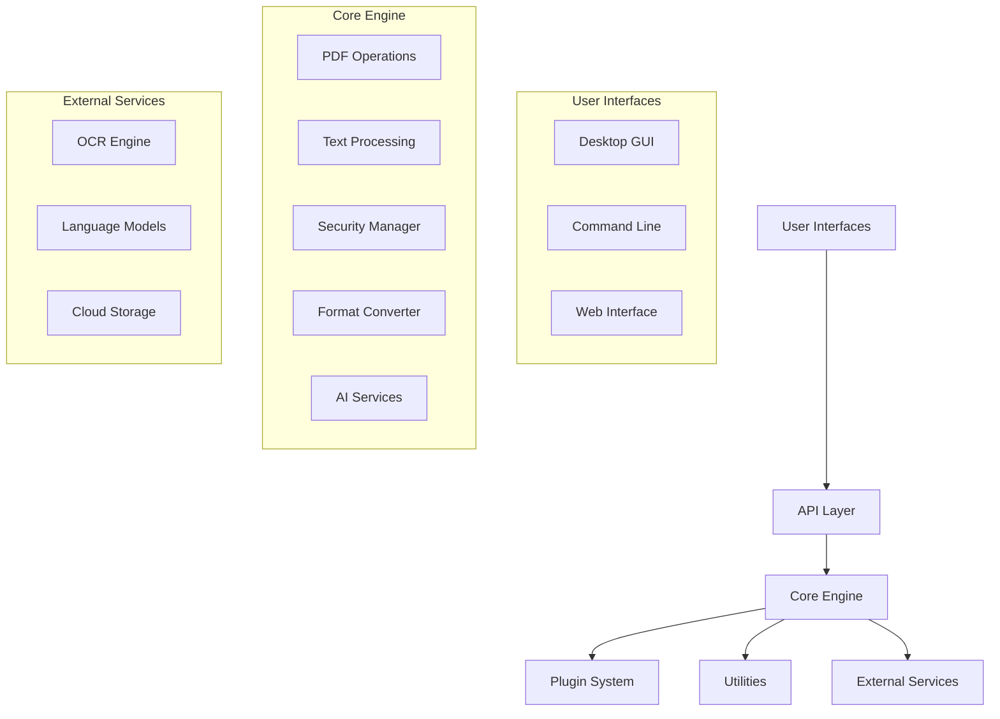

# Smart PDF Toolkit - Design Document

## Overview

The Smart PDF Toolkit is designed as a modular, extensible Python application that provides comprehensive PDF processing capabilities. The architecture follows a layered approach with clear separation between core functionality, user interfaces, and external integrations. The system is built around a plugin-based architecture that allows for easy extension and customization.

The toolkit leverages multiple specialized PDF libraries to provide robust functionality: PyMuPDF (fitz) for high-performance operations, pdfplumber for precise text extraction, and pypdf for compatibility. This multi-library approach ensures we can handle edge cases and provide the best tool for each specific operation.

## Architecture

### High-Level Architecture



### System Layers

1. **Presentation Layer**: Multiple user interfaces (GUI, CLI, Web)
2. **API Layer**: Unified interface for all operations with request/response handling
3. **Business Logic Layer**: Core PDF processing engine with specialized modules
4. **Data Access Layer**: File system operations and temporary file management
5. **Integration Layer**: External service connectors (OCR, AI, cloud storage)

## Components and Interfaces

### Core Engine Components

#### PDFOperationsManager
```python
class PDFOperationsManager:
    """Handles basic PDF manipulation operations"""
    
    def merge_pdfs(self, input_files: List[str], output_file: str) -> OperationResult
    def split_pdf(self, input_file: str, page_ranges: List[tuple]) -> OperationResult
    def rotate_pages(self, input_file: str, page_rotations: Dict[int, int]) -> OperationResult
    def extract_pages(self, input_file: str, pages: List[int]) -> OperationResult
    def reorder_pages(self, input_file: str, new_order: List[int]) -> OperationResult
```

#### ContentExtractor
```python
class ContentExtractor:
    """Extracts various content types from PDFs"""
    
    def extract_text(self, pdf_path: str, preserve_layout: bool = True) -> TextExtractionResult
    def extract_images(self, pdf_path: str, output_dir: str) -> ImageExtractionResult
    def extract_tables(self, pdf_path: str, format: str = 'csv') -> TableExtractionResult
    def extract_metadata(self, pdf_path: str) -> MetadataResult
    def extract_links(self, pdf_path: str) -> LinkExtractionResult
```

#### OCRProcessor
```python
class OCRProcessor:
    """Handles OCR operations for scanned PDFs"""
    
    def perform_ocr(self, pdf_path: str, languages: List[str] = None) -> OCRResult
    def preprocess_images(self, images: List[Image]) -> List[Image]
    def detect_language(self, text: str) -> str
    def get_confidence_scores(self, ocr_result: OCRResult) -> Dict[int, float]
```

#### FormatConverter
```python
class FormatConverter:
    """Handles conversion between PDF and other formats"""
    
    def pdf_to_images(self, pdf_path: str, format: str, quality: int) -> ConversionResult
    def images_to_pdf(self, image_paths: List[str], output_path: str) -> ConversionResult
    def pdf_to_office(self, pdf_path: str, target_format: str) -> ConversionResult
    def html_to_pdf(self, html_content: str, output_path: str) -> ConversionResult
    def office_to_pdf(self, input_path: str, output_path: str) -> ConversionResult
```

#### SecurityManager
```python
class SecurityManager:
    """Manages PDF security features"""
    
    def add_password(self, pdf_path: str, user_pwd: str, owner_pwd: str = None) -> SecurityResult
    def remove_password(self, pdf_path: str, password: str) -> SecurityResult
    def set_permissions(self, pdf_path: str, permissions: PermissionSet) -> SecurityResult
    def add_watermark(self, pdf_path: str, watermark: Watermark) -> SecurityResult
    def add_digital_signature(self, pdf_path: str, certificate: Certificate) -> SecurityResult
```

#### OptimizationEngine
```python
class OptimizationEngine:
    """Handles PDF optimization and compression"""
    
    def compress_pdf(self, pdf_path: str, compression_level: int) -> OptimizationResult
    def optimize_for_web(self, pdf_path: str) -> OptimizationResult
    def optimize_images(self, pdf_path: str, quality: int) -> OptimizationResult
    def optimize_fonts(self, pdf_path: str, subset_fonts: bool) -> OptimizationResult
    def convert_color_space(self, pdf_path: str, target_space: str) -> OptimizationResult
```

#### AIServices
```python
class AIServices:
    """Provides AI-powered PDF analysis features"""
    
    def summarize_document(self, pdf_path: str, summary_length: int) -> SummaryResult
    def answer_question(self, pdf_path: str, question: str) -> AnswerResult
    def analyze_content(self, pdf_path: str) -> ContentAnalysisResult
    def classify_document(self, pdf_path: str) -> ClassificationResult
    def translate_content(self, pdf_path: str, target_language: str) -> TranslationResult
```

### API Layer

#### RESTful API Design
```python
# Core endpoints
POST /api/v1/pdf/merge
POST /api/v1/pdf/split
POST /api/v1/pdf/rotate
GET  /api/v1/pdf/{id}/extract/text
GET  /api/v1/pdf/{id}/extract/images
POST /api/v1/pdf/convert
POST /api/v1/pdf/secure
POST /api/v1/pdf/optimize
POST /api/v1/pdf/ocr
POST /api/v1/ai/summarize
POST /api/v1/ai/question
```

#### Batch Processing API
```python
class BatchProcessor:
    """Handles batch operations on multiple PDFs"""
    
    def create_batch_job(self, operation: str, files: List[str], params: Dict) -> BatchJob
    def get_batch_status(self, job_id: str) -> BatchStatus
    def cancel_batch_job(self, job_id: str) -> bool
    def get_batch_results(self, job_id: str) -> BatchResults
```

### User Interface Components

#### Desktop GUI (PyQt6/PySide6)
- **Main Window**: Central hub with tabbed interface
- **File Browser**: Drag-and-drop PDF file management
- **Operation Panels**: Specialized interfaces for each operation type
- **Progress Dialogs**: Real-time operation feedback
- **Settings Manager**: Configuration and preferences
- **Plugin Manager**: Enable/disable and configure plugins

#### Command Line Interface
- **Argument Parser**: Comprehensive CLI argument handling
- **Operation Commands**: Individual commands for each operation
- **Batch Commands**: Bulk operation support
- **Configuration Commands**: Settings management via CLI
- **Help System**: Detailed usage documentation

#### Web Interface (FastAPI + React)
- **File Upload**: Drag-and-drop web interface
- **Operation Dashboard**: Web-based operation controls
- **Progress Tracking**: Real-time operation status
- **Result Download**: Processed file delivery
- **User Management**: Authentication and session handling

## Data Models

### Core Data Structures

```python
@dataclass
class PDFDocument:
    """Represents a PDF document with metadata"""
    path: str
    page_count: int
    file_size: int
    creation_date: datetime
    modification_date: datetime
    author: str
    title: str
    is_encrypted: bool
    permissions: PermissionSet

@dataclass
class OperationResult:
    """Standard result format for all operations"""
    success: bool
    message: str
    output_files: List[str]
    execution_time: float
    warnings: List[str]
    errors: List[str]

@dataclass
class BatchJob:
    """Represents a batch processing job"""
    job_id: str
    operation: str
    status: JobStatus
    total_files: int
    processed_files: int
    failed_files: int
    created_at: datetime
    completed_at: Optional[datetime]
    results: List[OperationResult]

@dataclass
class ExtractionResult:
    """Base class for content extraction results"""
    success: bool
    content_type: str
    output_path: Optional[str]
    metadata: Dict[str, Any]
```

### Configuration Models

```python
@dataclass
class ApplicationConfig:
    """Application-wide configuration"""
    temp_directory: str
    max_file_size: int
    ocr_languages: List[str]
    ai_api_key: Optional[str]
    compression_default: int
    batch_size_limit: int

@dataclass
class PluginConfig:
    """Plugin configuration structure"""
    name: str
    enabled: bool
    version: str
    settings: Dict[str, Any]
    dependencies: List[str]
```

## Error Handling

### Exception Hierarchy

```python
class PDFToolkitError(Exception):
    """Base exception for all toolkit errors"""
    pass

class PDFProcessingError(PDFToolkitError):
    """Errors during PDF processing operations"""
    pass

class SecurityError(PDFToolkitError):
    """Errors related to PDF security operations"""
    pass

class ConversionError(PDFToolkitError):
    """Errors during format conversion"""
    pass

class OCRError(PDFToolkitError):
    """Errors during OCR processing"""
    pass

class AIServiceError(PDFToolkitError):
    """Errors from AI service integration"""
    pass
```

### Error Recovery Strategies

1. **Graceful Degradation**: Fall back to alternative libraries when primary fails
2. **Retry Logic**: Automatic retry for transient failures with exponential backoff
3. **Partial Success Handling**: Continue processing when some operations fail
4. **User Notification**: Clear error messages with suggested solutions
5. **Logging**: Comprehensive error logging for debugging and monitoring

## Testing Strategy

### Unit Testing
- **Core Operations**: Test each PDF operation with various file types
- **Content Extraction**: Verify accuracy of text, image, and table extraction
- **Security Features**: Test password protection and permission settings
- **Format Conversion**: Validate conversion quality and format support
- **Error Handling**: Test error conditions and recovery mechanisms

### Integration Testing
- **Library Integration**: Test interaction between different PDF libraries
- **API Testing**: Validate REST API endpoints and responses
- **UI Testing**: Automated testing of GUI components
- **Batch Processing**: Test large-scale operations and resource management

### Performance Testing
- **File Size Limits**: Test with various PDF sizes (small to very large)
- **Memory Usage**: Monitor memory consumption during operations
- **Processing Speed**: Benchmark operation performance
- **Concurrent Operations**: Test multi-threading and parallel processing

### Security Testing
- **Password Protection**: Verify encryption strength and password handling
- **Permission Enforcement**: Test access control mechanisms
- **Input Validation**: Test against malicious PDF files
- **Data Sanitization**: Ensure no sensitive data leakage

## Deployment and Distribution

### Package Structure
```
smart_pdf_toolkit/
├── src/
│   ├── core/           # Core PDF processing engine
│   ├── api/            # REST API implementation
│   ├── gui/            # Desktop GUI application
│   ├── cli/            # Command-line interface
│   ├── web/            # Web interface
│   ├── plugins/        # Plugin system
│   └── utils/          # Shared utilities
├── tests/              # Test suites
├── docs/               # Documentation
├── config/             # Configuration files
└── scripts/            # Build and deployment scripts
```

### Distribution Methods
1. **PyPI Package**: Standard Python package installation
2. **Standalone Executables**: PyInstaller-based executables for non-Python users
3. **Docker Containers**: Containerized deployment for server environments
4. **Web Service**: Cloud-hosted API service
5. **Desktop Installers**: Platform-specific installers (Windows MSI, macOS DMG, Linux AppImage)

### Configuration Management
- **Environment Variables**: Runtime configuration
- **Configuration Files**: YAML/JSON configuration files
- **User Preferences**: Per-user settings storage
- **Plugin Configuration**: Individual plugin settings
- **Cloud Configuration**: Remote configuration management for enterprise deployments